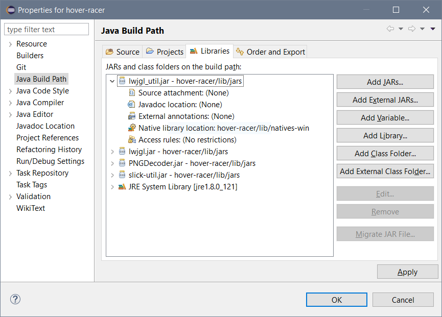

# Hover-Racer

## Setting up the build path
Before compiling the code you must add the LWJGL .jars to your classpath. In Eclipse this is done by going to the project properties, "Java Build Path", "Add Jars..." and adding all .jars in the `/lib/jars` folder.

Once the .jars have been added, expand `lwjgl_util.jar` and under "Native library location" select the natives folder for your operating system.

(Optional) you can also add the source for JOML which adds Javadocs for all methods and may help in debugging.

JUnit 4 is now also required, add this with "Add Library..." and select JUnit 4.

**Note!!** Make sure that you are adding the .jars from `/lib/jars` and **NOT** from `/bin/lib/jars` as this will mess up your build and cause Eclipse to make `bin1` as well as `bin`. 

## Running the game
Once the build path has been configured the game can be run via the MainMenu class `userInterface/MainMenu`.

# Interesting Seeds
- 8702257163401221369
- -3776264373565894405
- -7119786751459852624
