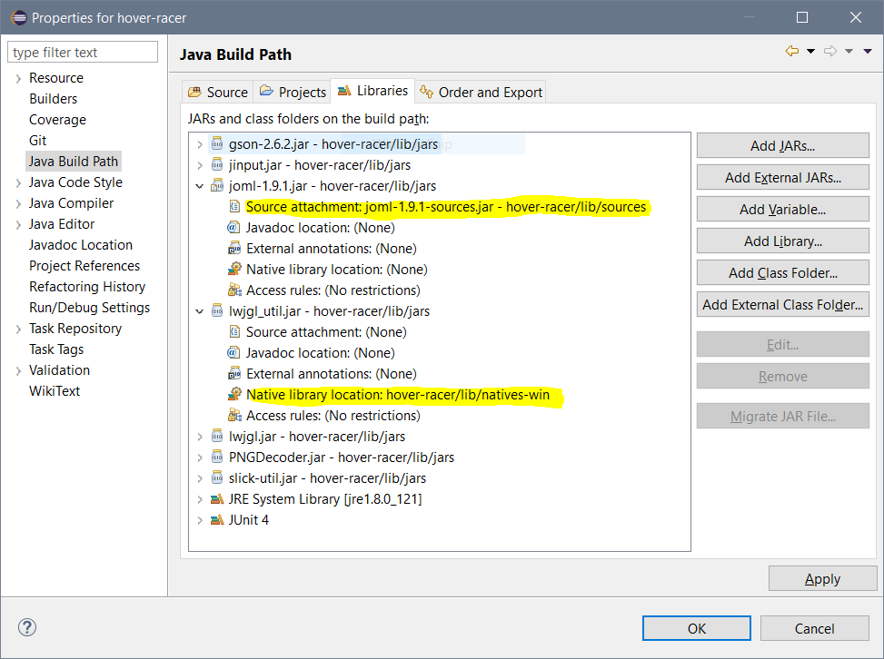

# Hover-Racer
The trello board for this project can be found [here](https://trello.com/b/2euP6bQy/planning).
## Setting up the build path
Before compiling the code you must add the LWJGL .jars to your classpath. In Eclipse this is done by going to the project properties, "Java Build Path", "Add Jars..." and adding all .jars in the "/lib/jars" folder.

Once the .jars have been added, expand "lwjgl_util.jar" and under "Native library location" select the natives folder for your operating system.

